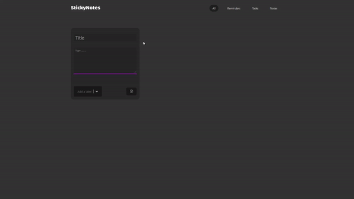

<h1 align="center">
  <br>
  Sticky Notes App
  <br>
</h1>



<br>

## Description
This is a simple Sticky Notes app that allows you to create and organize virtual sticky notes. It provides a responsive user-friendly interface for adding, editing, and deleting notes 🌟

<br>
#Features
    - Create new sticky notes with custom titles and content.
    - Delete unwanted sticky notes.
    - Responsive design for a seamless experience across different devices.
    - Local storage support to persist your notes even if you close the app.
<br>

## Technologies

The following technologies and tools were used in the development of this project:

    *React
    *Vite
    *React Router
    *Framer Motion
    *Material UI
    *NPM
<br>

## Demo

A live demo of the Sticky Notes app is available at https://sticky-notes-swart.vercel.app/.

<br>

## Installation and Usage

To install and run this application locally, follow these steps:

```bash
# Clone this repository
$ git clone https://github.com/your-username/sticky-notes-app.git

# Install dependencies
$ npm install

# Run the app
$ npm run dev

# Run the app
Open http://localhost:3000 in a web browser.
```

<br>
<hr>
<br>

Thank you for checking out this project! If you have any questions or feedback, please don't hesitate to get in touch.
> Twitter [@zarzapie](https://twitter.com/zarzapie)

